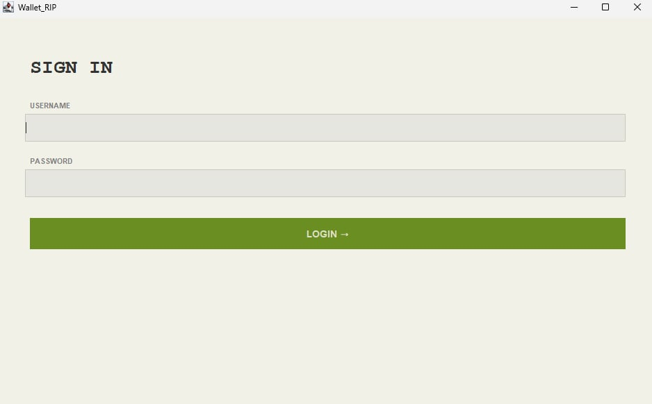
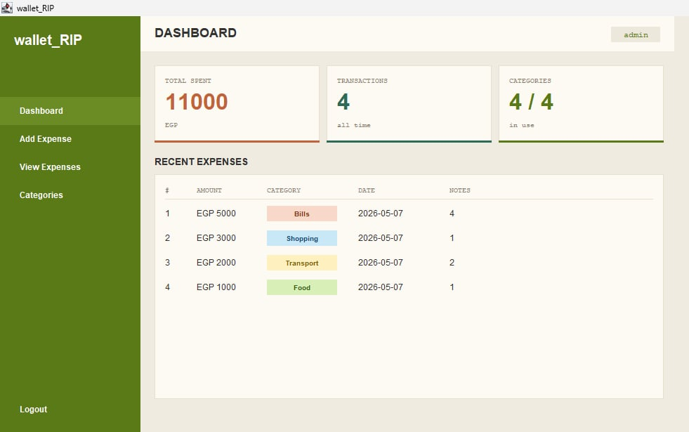
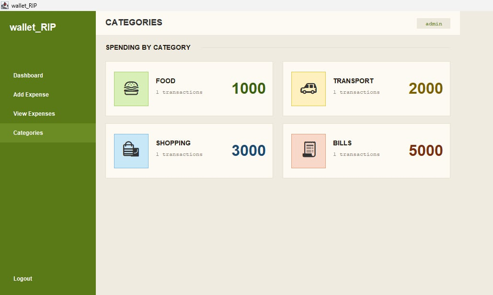

# 💸 wallet_RIP

> **Track. Every. Penny.** — A simple desktop expense tracker built with Java Swing.
> No excuses. No nonsense.


---

## 📖 About

**wallet_RIP** is a lightweight personal finance desktop application that helps you track your daily expenses, monitor your balance, and break down spending by category. It's built entirely with **Java Swing** using a clean separation between the UI screens and the data/logic layer.

The app ships with five screens: a login gate, a dashboard with live stats, an expense entry form, a full transaction list, and a per-category spending breakdown.

---

## ✨ Features

- 🔐 **Secure login screen** with a default account to get started instantly
- 📊 **Dashboard** showing balance, total spent, and transaction count at a glance
- ➕ **Add expenses** with amount, category, date, and notes
- 📋 **View all expenses** in a sortable, scrollable table
- 🗂️ **Category breakdown** — see how much you've spent per category and how many transactions
- 🎨 Clean, consistent UI theme (olive green + ink) across every screen

---

## 🖼️ Screenshots

| Login | Dashboard |
|-------|-----------|
|  |  |

| Add Expense | View Expenses |
|-------------|---------------|
|  |  |

| Categories |
|------------|
|  |

---

## 🛠️ Tech Stack

| Layer | Technology |
|-------|-----------|
| Language | Java |
| GUI Framework | Java Swing |
| Layout Managers | `BorderLayout`, `GridBagLayout`, `GridLayout` |
| Data Display | `JTable` + `DefaultTableModel` |
| Data Storage | In-memory (`ArrayList<Expense>`) |

**Key Swing components used:** `JFrame`, `JPanel`, `JLabel`, `JTextField`, `JPasswordField`, `JButton`, `JComboBox`, `JTable`, `JScrollPane`.

---

## 📂 Project Structure

> Adjust this to match your actual files and package names.

```
wallet_RIP/
├── src/
│   ├── Main.java                # Application entry point
│   ├── ui/
│   │   ├── LoginFrame.java      # Screen 1 — login
│   │   ├── Dashboard.java       # Screen 2 — stats + recent expenses
│   │   ├── AddExpense.java      # Screen 3 — new expense form
│   │   ├── ViewExpenses.java    # Screen 4 — full expense table
│   │   └── Categories.java      # Screen 5 — spending by category
│   ├── model/
│   │   └── Expense.java         # Expense data model
│   └── service/
│       └── ExpenseManager.java  # Add, list, getTotalByCategory()
├── screenshots/                 # README images
└── README.md
```

---

## 🚀 Getting Started

### Prerequisites

- **JDK 17** or newer installed ([download here](https://adoptium.net/))
- Any IDE (IntelliJ IDEA, Eclipse, NetBeans) or just the command line

### Installation

```bash
# Clone the repository
git clone https://github.com/your-username/wallet_RIP.git
cd wallet_RIP
```

### Run

**Using the command line:**

```bash
# Compile
javac -d bin src/**/*.java

# Run (adjust the class name if your entry point differs)
java -cp bin Main
```

**Using an IDE:** open the project, then run `Main.java`.

---

## 🔑 Default Login

| Username | Password |
|----------|----------|
| `admin`  | `1234`   |

> ⚠️ These are demo credentials. Change or remove them before using the app for anything real.

---

## 🧭 Usage

1. **Log in** with the default credentials.
2. On the **Dashboard**, check your balance, total spent, and transaction count.
3. Go to **Add Expense**, fill in the amount, pick a category, set the date, and add an optional note.
4. Open **View Expenses** to see every transaction in one table.
5. Open **Categories** to see totals and transaction counts grouped by category.

**Built-in categories:** 🍔 Food · 🚌 Transport · 🛍️ Shopping · 💡 Bills

---

## 🗺️ Roadmap

Possible improvements for future versions:

- [ ] Persist data to a file or database (so expenses survive a restart)
- [ ] Multi-user accounts with real authentication
- [ ] Edit and delete existing expenses
- [ ] Date-range filtering and search
- [ ] Charts/graphs for visual spending trends
- [ ] Export to CSV or PDF

---

## 🤝 Contributing

Contributions are welcome! Feel free to fork the repo, open an issue, or submit a pull request.

---

## 📝 License

This project is licensed under the MIT License — see the [LICENSE](LICENSE) file for details.

---

## 👩‍💻 Author

**Reem Said** — Faculty of Computers & Information

> Made with ☕ and Java Swing.
